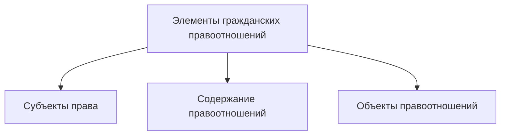

# Юридические факты
**Юридические факты**: конкретные жизненные обстоятельства, с которым нормы права связывают возникновение, изменение или прекращение правоотношений:
- ***Правообразующие*** - возникновение субъектных прав и юридических обязанностей
- ***Правоизменяющие*** - изменение правоотношений
- ***Правопрекращающие*** - прекращение правоотношений

Характеры связи с индивидуальной волей лиц:
- События (нет воли участников)
- Действия (внешние проявления воли участников):
	- Правомерные:
		- Юридические индивидуальные акты (цель: последствия)
		- Юридические поступки (без цели последствий)
	- Неправомерные

# Предмет и метод гражданского права
**Гражданское право** - отрасль права, регулирующая имущественные и личные неимущественные отношения, основанные на равенстве, автономии воли и имущественной самостоятельности участников
Предметом гражданского права являются имущественные и связанные с ними личные неимущественные отношения
**Имущественные отношения** - общественные отношения, возникающие по поводу различного рода материальных благ, имеющих стоимостный характер
**Личные неимущественные отношения** - общественные отношения, возникающие по поводу нематериальных благ, имеющих взаимную оценку участникам индивидуальных качеств личности друг друга
# Гражданские правоотношения

Особенности:
- Устанавливается по воле участвующих а них лиц за исключением возникновения обязательства из деликтов, событий и т.д.
- Равенство сторон, их юридическая независимость друг от друга
- Подчинение сторон только закону и условиям договора

**Содержание правоотношений** - взаимодействие его участников, осуществляемое в соответствии с их субъективными правами и обязанностями, а также совокупность этих прав и обязанностей
**Субъективное гражданское право** - юридически обеспеченная мера возможного поведения управомоченного лица, включающее следующие правомочия:
- На совершение определённых действий
- Требовать определённых действий от другого участника правоотношений
- На защиту
- Обладать определённым благом

**Субъективная гражданская обязанность** - обусловленная мера необходимого поведения обязанного лица в гражданском правоотношении, видами которой, выступает обязанность, вытекающие из:
- Запретительных норм гражданского права
- Требований, которые законодательство предъявлять при реализации права
- Конкретных гражданско-правовых отношений

**Объект гражданского права** - то, по поводу чего оно складывается или то, на что направлены субъектные права и обязанности его участников
**Метод правового регулирования** - совокупность приёмов, способов воздействия права на общественные отношения, их юридических особенностей в данной отрасли права