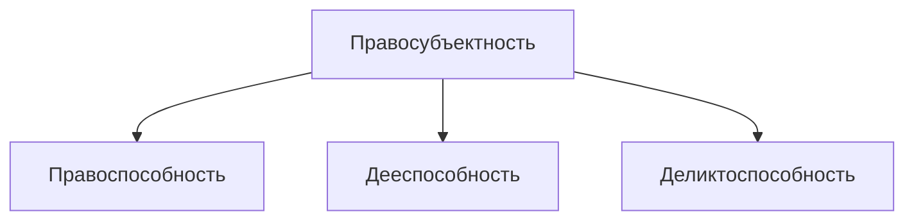

# Физические лица
- Граждане РФ
- Иностранные граждане
- Лица без гражданства
- Лица с двумя и более гражданствами

Гражданин в праве:
- Иметь имущество на праве собственности
- Наследовать и завещать имущество
- Заниматься предпринимательской и любой иной не запрещённой законодательным актам деятельностью
- Создавать юридические лица самостоятельно или совместно с другими
- Совершать не противоречащие законодательству сделки и участвовать в обязательствах
- Избирать место жительства
- Иметь права авторов произведения науки, литературы, искусства, изобретений и или иных охраняемых законодательством результатов
- Иметь иные имущественные и личные неимущественные права

- **Гражданская правоспособность** — способность иметь гражданские права и нести обязанности
- **Гражданская правоспособность** признается в равной мере за всеми гражданами
- **Правоспособность гражданина** возникает в момент его рождения и прекращается смертью
- **Гражданская дееспособность** — способность гражданина своими действиями приобретать и осуществлять гражданские права, создавать для себя гражданские обязанности и исполнять их
- **Гражданская дееспособность** возникает в полном объёме с наступлением совершеннолетия, то есть по достижении восемнадцатилетнего возраста
- **Деликтоспособность** — способность лица самостоятельно нести ответственность за вред, причинённый его противоправным деянием (действием либо бездействием)

Основания наступления полной дееспособности:
- Достижение 18 лет
- Вступление в брак до 18
- Эмансипация

Несовершеннолетние в возрасте от 6 до 14 лет
Вправе самостоятельно совершать
- мелкие бытовые сделки
- сделки, направленные на безвозмездное получение выгоды, не требующие нотариального удостоверения или государственной регистрации
- сделки по распоряжению средствами, предоставленными законным представителем или с согласия последнего 3-м лицом для определённой цели или для свободного распоряжения

Не вправе совершать
Иные сделки, которые от имени малолетних совершают их родители (другие законные представители)
Ответственность
Не несут самостоятельную имущественную ответственность по сделкам и за причинённый ими вред\*
> \*Имущественную ответственность по сделкам малолетнего и за причинённый им вред несут его родители или другие законные представители

