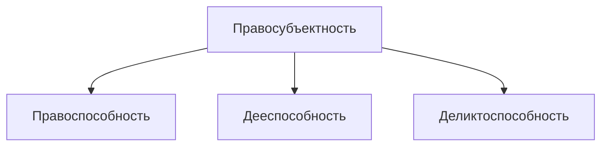
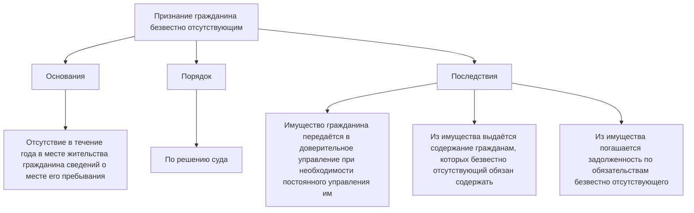

# Физические лица
- Граждане РФ
- Иностранные граждане
- Лица без гражданства
- Лица с двумя и более гражданствами

Гражданин в праве:
- Иметь имущество на праве собственности
- Наследовать и завещать имущество
- Заниматься предпринимательской и любой иной не запрещённой законодательным актам деятельностью
- Создавать юридические лица самостоятельно или совместно с другими
- Совершать не противоречащие законодательству сделки и участвовать в обязательствах
- Избирать место жительства
- Иметь права авторов произведения науки, литературы, искусства, изобретений и или иных охраняемых законодательством результатов
- Иметь иные имущественные и личные неимущественные права

- **Гражданская правоспособность** — способность иметь гражданские права и нести обязанности
- **Гражданская правоспособность** признается в равной мере за всеми гражданами
- **Правоспособность гражданина** возникает в момент его рождения и прекращается смертью
- **Гражданская дееспособность** — способность гражданина своими действиями приобретать и осуществлять гражданские права, создавать для себя гражданские обязанности и исполнять их
- **Гражданская дееспособность** возникает в полном объёме с наступлением совершеннолетия, то есть по достижении восемнадцатилетнего возраста
- **Деликтоспособность** — способность лица самостоятельно нести ответственность за вред, причинённый его противоправным деянием (действием либо бездействием)

# Дееспособность

Основания наступления полной дееспособности:
- Достижение 18 лет
- Вступление в брак до 18
- Эмансипация

Несовершеннолетние в возрасте от 6 до 14 лет
Вправе самостоятельно совершать
- мелкие бытовые сделки
- сделки, направленные на безвозмездное получение выгоды, не требующие нотариального удостоверения или государственной регистрации
- сделки по распоряжению средствами, предоставленными законным представителем или с согласия последнего 3-м лицом для определённой цели или для свободного распоряжения

Не вправе совершать
Иные сделки, которые от имени малолетних совершают их родители (другие законные представители)
Ответственность
Не несут самостоятельную имущественную ответственность по сделкам и за причинённый ими вред\*
> \*Имущественную ответственность по сделкам малолетнего и за причинённый им вред несут его родители или другие законные представители

Несовершеннолетние в возрасте от 14 до 18 лет (ст. 27 ГК РФ):
- Вправе самостоятельно без согласия родителей (законных представителей)
- Распоряжаться своим заработком, стипендией и иными доходами
- Осуществлять авторские права и права авторов изобретений
- Вносить вклады в кредитные учреждения и распоряжаться ими
- Совершать мелкие бытовые сделки
- Быть членами кооперативов при достижении 16 лет
- Вправе с письменного согласия родителей (законных представителей) 
- Совершать иные сделки

Самостоятельно несут имущественную ответственность по совершенным ими сделкам и за причиненный ими вред\*
> \*При недостаточности средств у несовершеннолетних субсидиарную ответственность несут их родители (законные представители)

# Ограничение дееспособности граждан. Признание гражданина недееспособным
Гражданин может быть ограничен в дееспособности с целью охраны здоровья, личных неимущественных и имущественных интересов его самого и членов его семьи
Он вправе:
- Совершать мелкие бытовые сделки
- Иные сделки, но лишь с согласия попечителя

Гражданин может быть признан недееспособным вследствие психического расстройства (душевной болезни или слабоумия). С целью защиты личных и имущественных интересов гражданина он может быть признан судом полностью недееспособным. Над ним устанавливается опека

# Опека и попечительство
1. Опека и попечительство устанавливается для защиты прав и интересов недееспособных или не полностью дееспособных граждан
2. Опекуны и попечители выступают в защиту прав и интересов своих подопечных в отношениях с любыми лицами, в том числе в судах, без специального полномочия
3. Опека и попечительство над несовершеннолетнего устанавливаются при отсутствии у них родителей, усыновителей, лишении судом родителей родительских прав, а также в случаях, когда такие граждане по иным причинам остались без родительского попечения, в частности когда родители уклоняются от их воспитания либо защиты их интересов
4. К отношениям, возникающим в связи с установлением, осуществлением и прекращением опеки или попечительства и не урегулированным настоящим Кодексом, применяются положения Федерального закона "Об опеке и попечительстве" и иные принятые в соответствии с ним нормативные правовые акты Российской Федерации.

Объявление гражданина умершим
Основания:
- Отсутствие в месте жительства гражданина сведений о месте его пребывания в течение **5 лет**
- В течение **6 месяцев**, если гражданин пропал без вести при обстоятельствах, угрожавших смертью или дающих основания предполагать его гибель от определённого несчастного случая
- В течение **2 лет со дня окончания военных действий**, если гражданин пропал без вести в связи с военными действиями
Порядок:
- По решению суда
Последствия:
- Наследование имущества гражданина
- Прекращение брака

Законодательство предусматривает некоторые ограничения прав на занятие предпринимательской деятельностью, их можно условно классифицировать по следующим видам:
1. Связанные с государственной службой;
2. Установленные для федеральных и мировых судей;
3. Специальные ограничения, установленные для работников некоторых организаций;
4. Установленные в рамках уголовного наказания;
5. Связанные с признанием индивидуального предпринимателя без образования юридического лица несостоятельным (банкротом);
6. Возрастные ограничения.