# Что такое жизненный цикл

| Вид | Что означает |
|---|---|
| **Жизненный цикл разработки** | Путь продукта от идеи до выпуска и последующей поддержки |
| **Жизненный цикл во время работы** | Состояния приложения или экрана во время работы на устройстве |

# Жизненный цикл разработки

Типичный путь приложения:

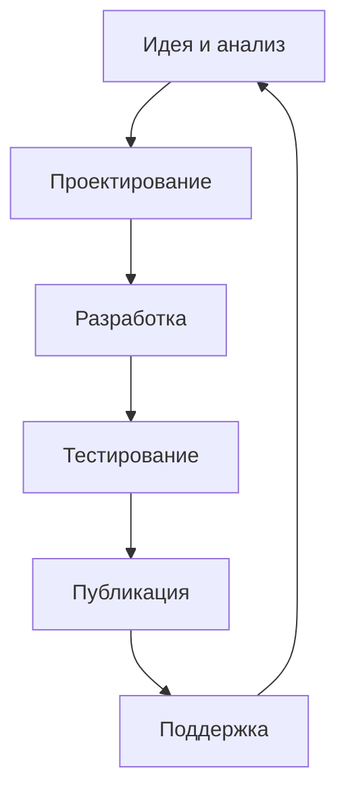

## Этапы

1. **Идея и анализ**
   - Что за приложение.
   - Для кого оно предназначено.
   - Какие задачи решает.

2. **Проектирование**
   - Дизайн экранов.
   - Внешний вид.
   - Логика работы приложения.

3. **Разработка**
   - Написание кода.
   - Создание приложения.
   - Сборка проекта.

4. **Тестирование**
   - Поиск ошибок.
   - Проверка на эмуляторе.
   - Проверка на реальных устройствах.

5. **Публикация**
   - Выпуск приложения в магазины.
   - Например, Google Play, RuStore и др.

6. **Поддержка**
   - Исправление ошибок.
   - Выпуск обновлений.

# Activity

Главный экран, который запускается первым, обычно представлен в проекте как:

```text
MainActivity
```

`MainActivity` — это тот экран, с которым мы уже работали в предыдущих лабораторных.

# Жизненный цикл Activity

Во время работы `Activity` проходит через разные состояния:

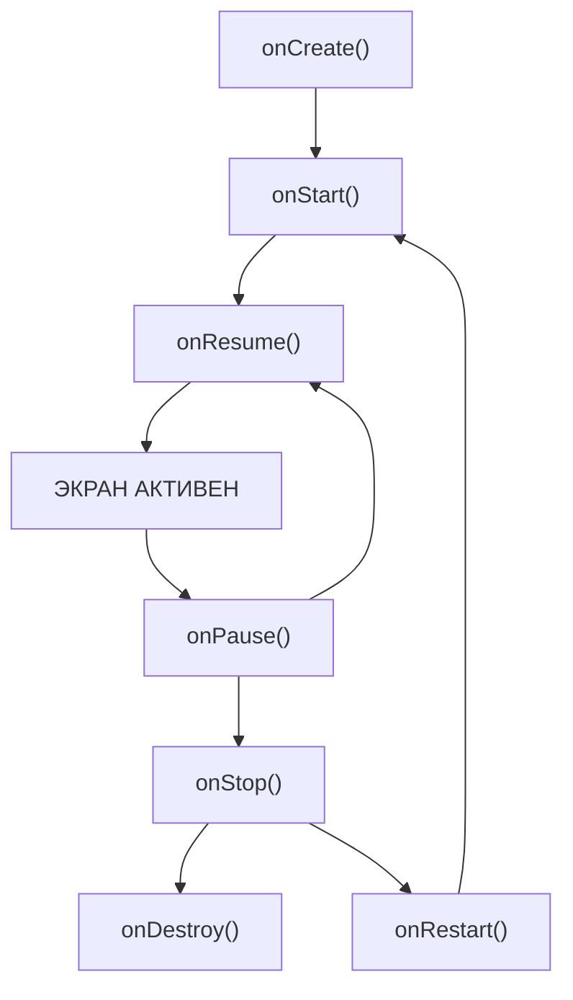

Основной путь проходит от `onCreate()` к активному состоянию и далее к остановке или уничтожению. При временной потере фокуса возможен возврат из `onPause()` в `onResume()`. При полном скрытии `Activity` перед возвращением вызывается `onRestart()`.

# Основные callback-методы Activity

## `onCreate()`

Вызывается при создании экрана.

Основная задача:

- Первичная настройка `Activity`.
- Создание элементов экрана.
- Подключение XML-разметки.
- Настройка необходимых объектов.
- Восстановление сохранённого состояния.

Главное знакомое действие:

```kotlin
override fun onCreate(...) {
    setContentView(R.layout.activity_main)
}
```

`setContentView()` подключает XML-разметку экрана.

## `onStart()`

Вызывается, когда экран становится **видимым**.

Основные переходы:

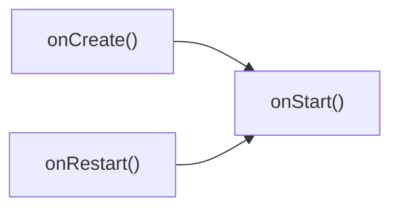

На этом этапе экран уже отображается, но ещё не находится в полностью активном состоянии.

## `onResume()`

Вызывается, когда экран выходит на передний план и готов взаимодействовать с пользователем.

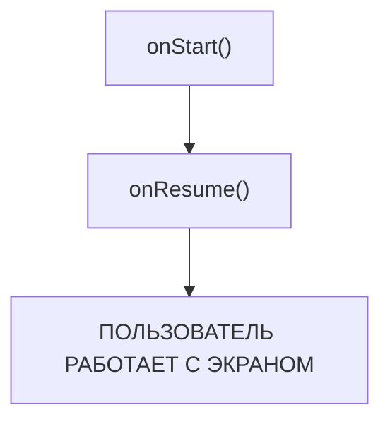

Здесь приложение уже готово:

- Реагировать на нажатия.
- Обрабатывать действия пользователя.
- Выполнять активные процессы.
- Использовать датчики, камеру, микрофон и т. п., если это необходимо приложению.

## `onPause()`

Вызывается, когда поверх текущего экрана появляется что-то другое, но текущий экран ещё может оставаться частично видимым.

Примеры:

- Системное окно.
- Другое окно поверх приложения.
- Работа в режиме разделённого экрана.

Основной переход:

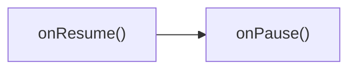

Главная задача — **быстро освободить или приостановить ресурсы**.

Например:

- Остановить камеру или микрофон.
- Поставить игру или видео на паузу.
- Прекратить тяжёлые вычисления.
- Быстро сохранить важные изменения.

> [!warning]
> `onPause()` должен выполняться быстро. Это не лучшее место для долгих операций.

## `onStop()`

Вызывается, когда экран **полностью перестаёт быть видимым**.

Например:

- Приложение свернули.
- Другое окно полностью перекрыло приложение.

Основной переход:

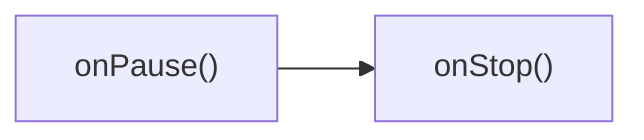

В этом состоянии имеет смысл:

- Остановить ненужную фоновую работу.
- Сохранить данные.
- Прекратить использование GPS и других ресурсоёмких механизмов.
- Освободить крупные объекты из памяти.

## `onRestart()`

Вызывается перед возвращением `Activity`, которая ранее была полностью скрыта через `onStop()`.

Пример полного возврата:

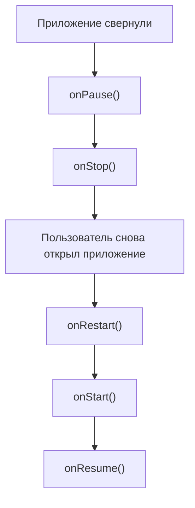

`onRestart()` — промежуточный этап перед повторным отображением экрана.

## `onDestroy()`

Финальный этап уничтожения `Activity`.

Вызывается, когда экран закрывается или система завершает его существование.

Примеры из лекции:

- Пользователь полностью закрыл экран.
- Экран был уничтожен из-за нехватки памяти.

Основные задачи:

- Закрытие подключений.
- Остановка фоновых задач.
- Освобождение ресурсов.
- Предотвращение утечек памяти.

# Главное по жизненному циклу

Основной путь:

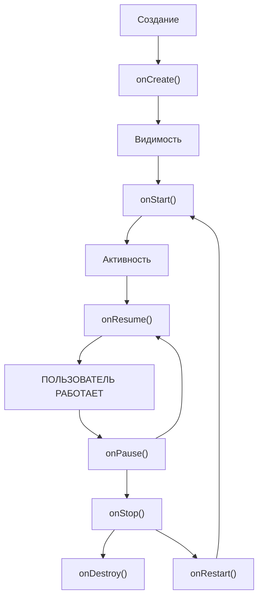

Жизненный цикл **не является только одной прямой**. Возможны возвраты:

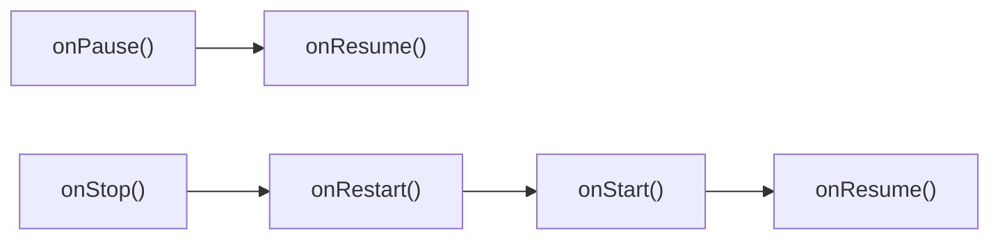

Также система может завершить процесс приложения, когда ей не хватает памяти.

# Зачем знать жизненный цикл

Понимание жизненного цикла нужно в первую очередь для:

- Сохранения данных.
- Экономии батареи.
- Правильной работы с ресурсами.
- Корректного поведения приложения при переключении между экранами.

# Ситуация: входящий звонок

При входящем звонке экран может потерять активность. Если экран полностью скрыт, после `onPause()` будет вызван `onStop()`:

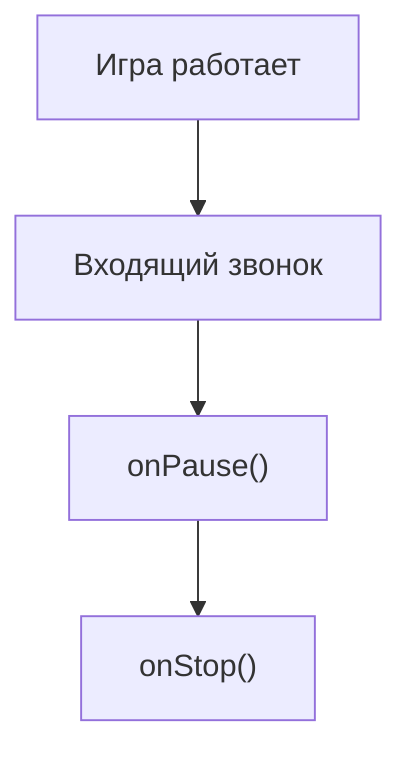

Игру нужно поставить на паузу.

После возврата:

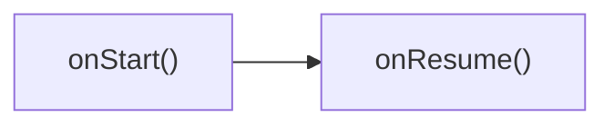

# Ситуация: кнопка «Домой»

При нажатии кнопки «Домой» приложение уходит в фон:

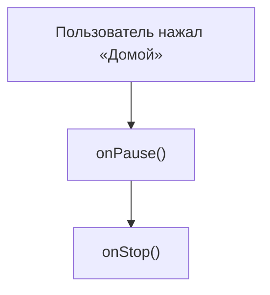

При возврате:


В фоновом состоянии стоит остановить ненужную работу, чтобы не расходовать ресурсы устройства.

# Ситуация: поворот экрана

При повороте телефона Android по умолчанию пересоздаёт экран:

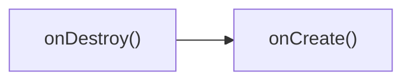

Из-за этого данные, введённые пользователем, могут потеряться, если состояние экрана не было сохранено.

# Структура типового Android-проекта

Типовой проект состоит из нескольких основных частей.

| Часть | Пример файла | Назначение |
|---|---|---|
| `manifests` | `AndroidManifest.xml` | Паспорт приложения |
| `kotlin+java` | `MainActivity.kt` | Код и логика |
| `res/layout` | `activity_main.xml` | Внешний вид экрана |
| `res/values` | `strings.xml` | Тексты |
| `res/values` | `colors.xml` | Цвета |
| `res/values` | `themes.xml` | Тема |
| `res/mipmap` / `drawable` | `ic_launcher` и др. | Иконки и изображения |
| `Gradle Scripts` | `build.gradle.kts` | Сборка и библиотеки |

# AndroidManifest.xml

`AndroidManifest.xml` можно воспринимать как **«паспорт» приложения**.

# MainActivity.kt

`MainActivity.kt` содержит код главного экрана.

Здесь находится:

```kotlin
onCreate()
```

И вызывается:

```kotlin
setContentView(...)
```

То есть именно код `Activity` связывает экран с его XML-разметкой.

# `res/layout`

Здесь располагается XML-разметка экрана.

Например:

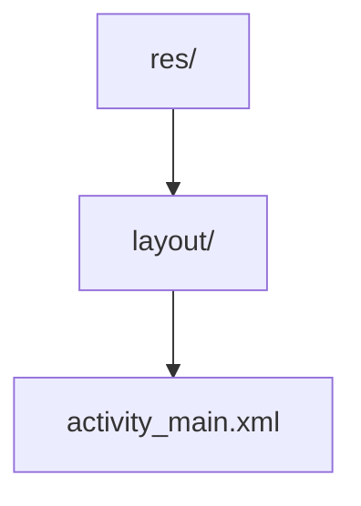

`activity_main.xml` отвечает за то, **как выглядит экран**.

# `res/values`

Здесь находятся отдельные ресурсы:

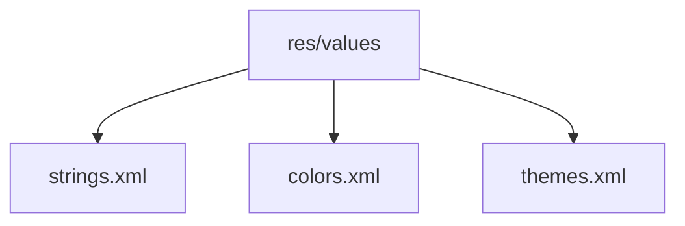

Они отвечают соответственно за:

- Тексты.
- Цвета.
- Тему приложения.

# `res/mipmap` и `res/drawable`

Здесь находятся изображения и элементы графики.

Например:

```text
ic_launcher
```

— значок приложения.

# Gradle Scripts

`Gradle` отвечает за процесс сборки проекта.

Один из важных файлов:

```text
build.gradle.kts
```

Он содержит настройки сборки и сведения о подключаемых библиотеках.

# Как части проекта связаны

Путь запуска приложения можно представить так:

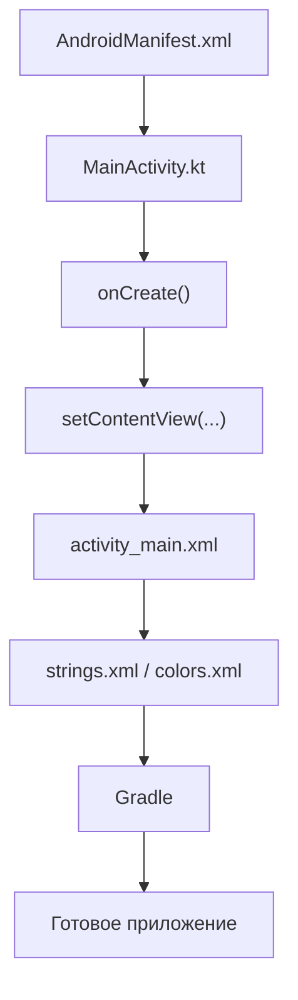

# По шагам

1. `AndroidManifest.xml` сообщает системе, какой экран должен быть стартовым.
2. Запускается `MainActivity`.
3. У `MainActivity` вызывается `onCreate()`.
4. Внутри `onCreate()` вызывается `setContentView(...)`.
5. Подключается `activity_main.xml`.
6. Разметка использует ресурсы из `res`.
7. `Gradle` собирает всё в приложение.
