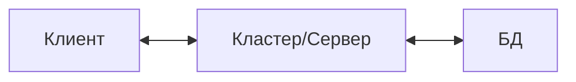
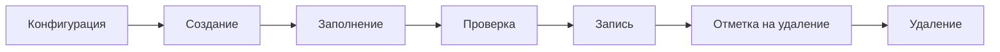

# Что делает приложение управляемым
Управляемое приложение - это современный режим запуска 1С, в котором вид и логика ПО разделены между сервером и клиентом
Платформа самостоятельно на базе конфигурации создаёт БД
# Уровни клиент-серверной архитектуры
1. Клиент - внешний вид и приём команд пользователя и отправка на сервер
2. Кластер - бизнес-логика, приём запросов, доступы, работа с БД
3. Сервер(а) БД

# Директивы выполнения
1. `НаКлиенте` - клиент
2. `НаСервере` - сервер
3. `НаКлиентеБезКонтекста` - клиент, без "лишних" данных
4. `НаСервереБезКонтекста` - сервер, без "лишних" данных

> [!tip] Примечание
> Использование директив "\*БезКонтекста" позволит избежать лишнего трафика при передачи с клиента на сервер и обратно

# Зоны ответственности
- Клиент - работа с пользователем
- Сервер - данные и бизнес-логика
# Объект конфигурации
**Объект конфигурации** - базовые блоки/детали, из которых создаётся любая прикладная программа
**Метаданные** - данные о данных: описание структуры, свойств и логики конфигурации, а не сами рабочие документы или записи пользователей
# Данные
Объектные - имеют самостоятельную сущность и обычно собственную ссылку:
- Элементы справочников
- Документы
- Бизнес-процессы и задачи

Необъектные - данные представлены записями регистров

# Менеджеры
**Менеджер прикладного объекта** - программный объект встроенного языка, служит "точкой входа" для управления конкретным объектом конфигурации в целом, а не отдельным его экземпляром
**Менеджер коллекций**
В глобальном контексте доступны коллекции менеджеров:
- Справочники
- Документы
- РегистрыСведений
- РегистрыНакоплений
- и т.д.
# Выборка
Выборка позволяет получить большое количество элементов без загрузки всех элементов
# Модуль менеджера
**Модуль менеджера объекта** - программный модуль, который позволяет описывать методы и логику, относящиеся ко всему классу объектов метаданных в целом, а не к конкретному экземпляру
# Ссылка и объект
**Ссылка** - уникальный идентификатор конкретного объекта БД
**Объект** - базовая структурная единица данных и алгортмов, из которых строиться любая конфигурация для учёта и управления
# Отличие ссылки и объекта
| Характеристика | Ссылка | Объект
| --- | --- | --- |
| Основное назначение | Индефикация и чтение | Изменение и запись |
| Храниться в реквизитах | Да | Да |
| Имеет метод `Записать()` | Нет | Да |
| Может быть пустой | Да | Нет |
| Получение | Поиск, выборка, реквезит | Через `ПолучитьОбъект` и `СоздатьЭлемент` |
# Регистры
**Регистры** - прикладной объект конфигурации, которые предназначены для хранения, накопления и обработки информации о хозяйственной деятельности компании
**Менеджер регистра** - обеспечивает доступ к операциям, связанным с регистром в целом
# Набор записей
**Набор записей** - объект встроенного языка, который представляет собой коллекцию отдельных записей, принадлежащих необъектным данным и позволяет считывать, изменять и записывать их группами
Перед чтение или записью набора рекомендуется установить отбор
# Менеджер записи регистра сведений
**Менеджер записи регистра сведений** применяется для работы с одной записью независимого регистра сведений
# Записи регистра
**Записи регистра** - отдельная строка, которую можно получить из набора записей
# Жизненный цикл объектов
**Жизненный цикл объектов** - последовательность состояний и операций, через которые проходит объект от создания до удаления или архивирования:
- *Технический* - создание, запись, изменение, удаление
- *Бизнес* - состояния объекта в предметной области

> [!tip] Примечание
> До записи объект существует только в памяти. После записи появляется ссылка

Пример (справочник):

