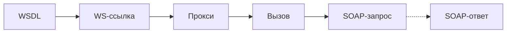
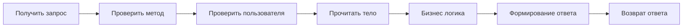
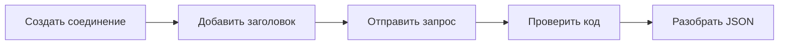

**Интеграция информационных систем** - процесс объединения разрозненных программных продуктов, БД и платформ в единую связную экосистему для автоматической работы без участия человека
Зачем это надо:
- Отсутствие ручного ввода
- Заказы и платежи
- Синхронизация
- Курсы и клиенты
- Уведомления

Общая схема интеграции:
- Формирование запроса
- Передача по сети
- Обработка внешней системой
- Формирование ответа
- Получение ответа
- Разбор данных
- Запись результата

# Веб-сервис
**Веб-сервис** - программная система, которая доступна через интернет и позволяет разным приложениям обмениваться данными и командами между собой

# Основные варианты интеграции
В 1С существует:
- SOAP и WS-ссылки
- HTTP-сервисы и REST API
- JSON и XML
- Файловый обмен 
- Очереди и брокеры сообщений
- Внешние обработи

# WS-ссылки и SOAP-сервисы
SOAP - протокол для обмена структурированными сообщениями в формате XML между различными системами через интернет
Использует:
- HTTP и HTTPS
- XML для передачи данных
- WSDL для описания сервиса
- Формализованные операции и типы данных

# WSDL
**WSDL** - язык на основе XML, который служит инструкцией или описанием для веб-сервиса
Содержит:
- Доступные операции
- Входные и выходные параметры
- Типы данных
- Адрес сервиса
- Формат сообщений и пространства имён

# WS
**WS-ссылка** - общий объект конфигурации, предназначенный для статического описания и подключения внешнего веб-сервиса
Хранит:
- Сведения об адресе
- WSDL
- Операциях
- Типах данных
- Пространствах имён
- Настройки подключения

# Последовательность работы

+:
- Строгий контракт и типы данных
- Поддержка сложных структур
- Развитая безопасность
- Удобство для корпоративных систем

-:
- Большой объём XML
- Сложная настройка и отладка
- Избыточность при простых запросах

WS-ссылки подходят в случаях:
- Внешний сервис предоставляет SOAP
- Доступен файл WSDL
- Требуются строго определённые операции
- Используются сложные типы данных
- Интеграция связана с банком, государством или крупной корпоративной системой

# HTTP и REST
**HTTP-сервис** - программный интерфейс, который позволяет различным приложениям и системам обмениваться данными через интернет с помощью стандартных HTTP-запросов

В 1С обычно включает:
- Имя и корневой url
- шаблоны адресов
- HTTP-методы и обработчики
- Параметры запроса
- Правила аутентификации
- Формат ответа

# Обработка HTTP запроса

+:
- Простое взаимодействие
- Поддержка разных клиентов
- Удобство для веб-приложений
- REST и JSON
- Простоя отладка
- Независимость от платформы

-:
- API и документация
- Безопасность требует отдельной настройки
- Разработчик определяет коды ошибок
- Возможны проблемы совместимости версий

**REST** - подход к построению HTTP-сервисов, основанный на работе с ресурсами
Принципы:
- Ресурсы, а не команды
- HTTP-методы определяют методы
- Единый интерфейс
- Отсутствие состояние

# JSON
**JSON** - лёгкий текстовый формат хранения и передачи данных
Используется в веб-сервисах, мобильных приложениях, интернет-магазинах и внешних системах
Плюсы - простая структура, читаемость и поддержка большинством ЯП

