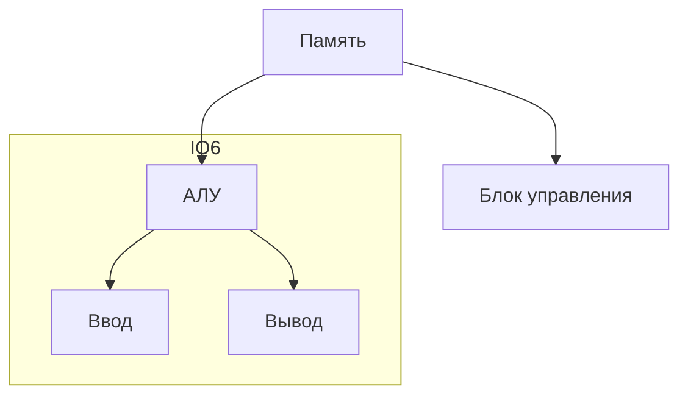

- 3000 лет до н.э. - Древний Вавилон, абак (счёты)
- 500 лет до н.э. - Китай, суаньлань
- 16 век - Россия, счёты
# Первые механические суммирующие машины
Леонардо да Винчи в конце 15 века создал чертёж 13-разрядного суммирующего устройства
В 1968 построена модель счётного устройства
# Суммирующая машина Паскаля
В 1642 Блез Паскаль создал первое счётное устройство - суммирующую машину
# Арифмометр Лейбница
В 1673 Готфрид Лейбниц построил первую счётную машину
В 1679 Лейбниц разъясняет, как выполнять двоичные вычисления
- В 1801 Жозеф Мари Жаккар, ткацкий станок управляемый **перфокартами**
# Аналитическая машина Чарльза Бэббиджа
В начале 19 века ос описал основу конструкцию вычислительной машины:
1. Должен быть "склад" (ПЗУ)
2. Должна быть "мельница" (АЛУ)
3. Должно быть устройство для передачи данных со "склада" на "мельницу" и обратно
4. Должна иметь интерфейсы ввода-вывода
# Первый программист
Бэббидж разрабатывал конструкцию аналитической машины в одиночку
В 1840 Бэббидж ездил по приглашению в Турин, где читал лекции о своей машине. Ада Лавлейс перевела эти лекции на английский язык, дополнив их комментариями. В комментариях был описан ЦВМ и инструкции по программированию
# Табулятор
В 1896 создал компанию TMC (ныне IBM)
# Термин "Компьютер"
В 1897 появилось в Оксфордском английском словаре как механическое вычислительное устройство
В 1946 дополнили понятиями о ***цифровых***, ***аналоговых*** и ***электронных*** компьютеров
# Первый аналоговый механический компьютер
В 1927 Вэнивар Буш создал аналоговый компьютер для расчёта траектории артилерии
# Первый механический арифмометр
Шведский инженер Вильгодт Теофил Однер изобрёл точную и практичную механическую вычислительную машину - арифмометр. И создал под это завод в 1880, после революции 1917 года фирма уехала в Швецию, а завод работал до 1970-х годов
# Арифмометр "Феликс"
Самый распространённый в СССР арифмометр. Выпускался с 1929 по 1978 на заводах Курска, Пензы и Москвы
# Машина Тьюринга
В 1936 Алан Тьюринг предложил идею, абстрактную, вычислительной машины для борьбы с шифрованием "Энигмы"
# Первый компьютер, собранный с применением электронных вакуумных ламп
Запущен 14 февраля 1946 года. Использовался для предсказания погоды, аэродинамика и изучения космоса
# Архитектура фон Неймана
Принцип построения машины "EDVAC" послужил основой для создания машины. Создана машина в 1948
Принцип:
1. Двоичная система
2. Принцип программного управления
3. Принцип однородности памяти
4. Принцип адресуемости памяти
5. Принцип последовательного программирования

# Первое поколение компьютеров
Особенности:
1. Наличие электронных вакуумных ламп
2. Устройства памяти на электростатических трубках
3. Для каждой машины свой язык
4. Невысокая производительность
5. Архитектура фон Неймана
6. Ограниченная область применения
# Первые электромеханические цифровые компьютеры Z-серия
В 1936 Конрадом Цузе построена модель механической вычислительной машины
В 1938 изготовил модель машины Z1 на 16 машинных слов, следующий год Z2 и через 2 года построил первую в мире действующую вычислительную машину с программным управлением
Машина состояла из:
- Память: 6422-разрядных числа с плавающей точкой, 7 для порядка и 15 для мантиссы
- Параллельный арифметический блок
- Команда включала операционную и адресную части
- Ввод с помощью десятичной клавиатуры
- Предусмотрен цифровой ввод
- Автоматическое преобразование из двоичной в десятичную и обратно

**Машины были уничтожены во время бомбардировок**
# Первый в мире электронный цифровой компьютер
В 1939 разработали и начали монтаж в университете штата Айова первый в США электронный цифровой компьютер созданный Атанасовым и Клиффордом Берри, но Атанасов ушёл в армию и машина завершена не была, но повлияла на Джона Мочли, создавшего через 2 года ЭНИАК
Джон Атанасов в 1939 опубликовал окончательный вариант своей концепции вычислительной машины:
1. Электричество для достижения цели
2. Основан на двоичной системе
3. Основа ПЗУ - конденсаторы, содержимое которых периодически обновляется во избежание ошибок
4. Расчёт на основе логических действий
# Первый ЭВМ СССР
Первый пробный пуск МЭСМ в ноябре 1950, а эксплуатация началась в 1951
В 1952 создана БЭСМ
МЭСМ (малая электронная счётная машина) БЭСМ - быстродействующая
# Второе поколение компьютеров
Особенности:
- Транзисторы
- Появляются устройства памяти на магнитных сердечниках
- Расширилось использование оборудования ввода-вывода
- Появились высокопроизводительные устройства для работы с магнитными лентами
- Быстродействие
- Появились языки программирования высокого уровня
- Гос. организации и крупные компании используют компьютеры для решения различных задач
# Первый компьютер на транзисторах
Начало массового производства транзисторов Texas Instruments 1954
В 1956 первый компьютер на транзисторах TX-O
В 1959 IBM выпустила мейнфрейм IBM 7090 и машину среднего класса IBM 1401
В 1960 IBM 1620 - самый популярный научный компьютер
# Прототипы первый винчестеров (HDD)
Весил 900 килограмм и ёмкость 5 Мбайт. Стоил $50 000
Состоял из 50 алюминиевых круглых постоянно вращающихся пластин
# Интегральные микросхемы
В 1958 Джек Килби из Texas Instruments и Роберт Нойс (будующий основатель INTEL) из Fairchild Semiconductor независимо друг от друга изобрели интегральную схему
Килби использовал - германий, Нойс - кремний
# Третье поколение компьютеров
Особенности:
1. Наличие единой архитектуры
2. В качестве элементарной базы в них используются интегральные схемы
3. Машины третье поколение имеют развитые ОС
В 1964 IBM начинает массовое производство компьютеров
В СССР под руководством Глушкова в 1966 была разработана первая персональная ЭВМ МИР-1. Главное отличие аппаратно реализованный язык производительности высокого уровня
# Первая компьютерная мышь
В 1967 Дуглас Карл Энгелльбарт создал первую компьютерную мышь
# Четвёртое поколение компьютеров
Особенности:
- Применение ПК
- Телекоммуникационная обработка данных
- Объединение в компьютерные сети
- Широкое использование СУБД
- Элементы интеллектуального поведения систем обработки данных
# Первый персональный компьютер IBM
IBM до конца 70-х годов была ведущей компанией по производству больших ЭВМ. К этому времени появились (с 1975 г.) и стали популярны ПК на базе микропроцессоров INTEL
В 1981 IBM выпускает ПК на базе INTEL 8088. Он использовал принцип открытой архитектуры, что позволяет менять детали на более новые
# Пятое поколение
Особенности: главный упор сделан на "интелектуальность", переход на архитектуру обработки знаний. Высокая производительность, низкая стоимость
# Шестое поколение
Начало с 2013 и до сих пор. Характеризуется внедрением "ИИ" (нейросетей)
# Итоги
ЭВМ - важнейший компоненет процесса выполнения различных действий вычислительного характера