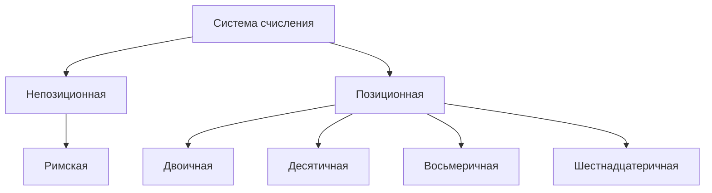

**Система счисления** - способ записи чисел

**Однородная система** - для всех разрядов набор одинаков
**Смешанная система** - в каждом разряде набор может меняться
$101011_2 = 2^0 * 1 + 2^1 * 1 + 2^2 * 0 + 2^3 * 1 + 2^5 * 1 = 43_{10}$
$N^0 = 1$
$N^1 = N$

а. $111_2 = 2^0 + 2^1 + 2^2 = 1 + 2 + 4 = 7_{10}$
б. $1110_2 = 2^1 + 2^2 + 2^3 = 2 + 4 + 8 = 14_{10}$
в. $11011_2 = 2^0 + 2^1 + 2^3 + 2^4 = 1 + 2 + 8 + 16 = 27_{10}$
г. $101010_2 = 2^1 + 2^3 + 2^5 = 2 + 8 + 32 = 42_{10}$
д. $1001011_2 = 2^0 + 2^1 + 2^3 + 2^6 = 1 + 2 + 8 + 64 = 75_{10}$
е. $11100111_2 = 2^0 + 2^1 + 2^2 + 2^5 + 2^6 + 2^7 = 1 + 2 + 4 + 16 + 32 + 64 = 119_{10}$
ж. $110110111_2 = 2^0 + 2^1 + 2^2 + 2^4 + 2^5 + 2^7 + 2^8 = 1 + 2 + 4 + 16 + 32 + 128 + 256 = 439$