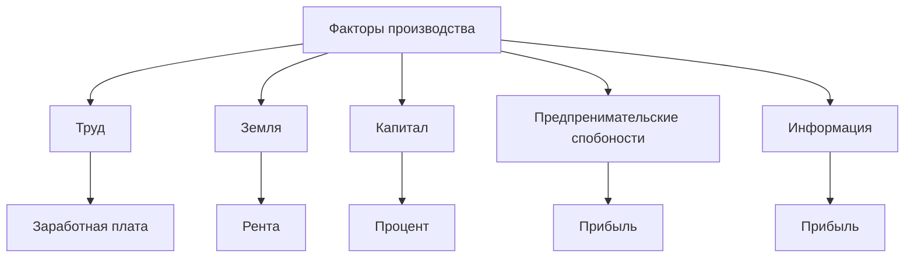

```mermaid
graph TD
ФП[Факторы производства] --> Труд --> ЗП[Заработная плата]
ФП --> Земля --> Рента
ФП --> Капитал --> Процент
ФП --> ПС[Предпренимательские спобоности] --> A[Прибыль]
ФП --> Информация --> B[Прибыль]
```
**Факторный доход** - доход, полученный с факторов производства