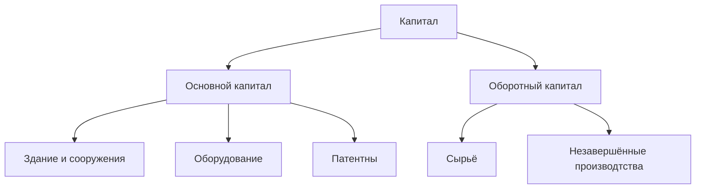

Капитал - накопленные физические ресурсы и финансовые сбережения, используемые для производства и финансирования производства экономических благ

| Параметр сравнения | Основной капитал | Оборотный капитал |
|---|---|---|
| **Состав** | Основные и нематериальные активы, финансовые вложения на срок более одного года | Запасы, дебиторская задолженность, деньги, финансовые вложения на срок до одного года |
| **Участие в производстве** | Несколько циклов | Один цикл |
| **Состояние** | Натуральная форма меняется постепенно по мере износа, в течение нескольких циклов | Натуральная форма сразу утрачивается в течение одного цикла |
| **Влияние на стоимость готовой продукции** | Переносит свою первоначальную стоимость на готовую продукцию по частям, за несколько циклов | Полностью переносит свою стоимость на готовую продукцию за один цикл |

> ДЗ: износ и амортизация. Что такое и их отличия